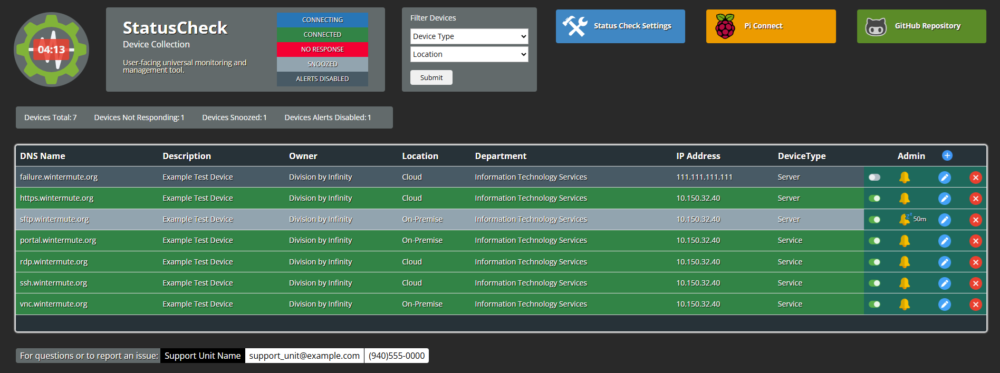
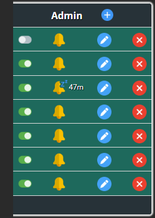
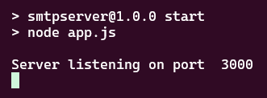

<table>
  <tr>
    <td></td>
    <td><h1>Status Check</h1></td>
    <td><p>The logo is courtesy of <a href="https://www.svgrepo.com/svg/281191/settings-gear" alt="CCO SVGRepo Image" title="CCO SVGRepo settings gear logo">SVG Repo</a></p></td>
  </tr>
</table>

Status Check is a javascript web application that can be used to monitor the status and manage devices on your network such as IoT devices (Raspberry Pi), desktops, printers, audio-visual components, and servers.  Any device that will respond to a ping (ICMP echo request) can be monitored, any device that can be connected with via **ssh**, **https**, **vnc**, **rdp**, or a **portal** can be managed by just adding a link and/or you can add a link to your endpoint management at the top of the page. The default lists of devices that is included in the repo includes a couple public websites, so you can monitor just about *anything*. Throw it on a server or run it on your local machine.  There are other ways for an IT professional to monitor devices in an enterprise environment, like [Zabbix](https://github.com/zabbix/zabbix), this is intended to be an easy to use dashboard with the essential features that you can share with end-users and front-line staff. We find it useful troubleshooting equipment deployments.

**Added password hashing:**
Edit **/config/users.json** and update the passwords for your accounts *using plaintext*.  Then from the **backend** folder:
```js
node hash_passwords.js
```
Check that the users.json now has your passwords hashed.  


- [Introduction](#introduction)
  - [Dashboard](#dashboard)
  - [config.json](#configjson)
  - [devices.json](#devicesjson)
  - [users.json](#usersjson)
- [Install Using Docker: Preferred](#install-using-docker-preferred)
  - [Quickstart](#quickstart)
  - [Create your **JWT\_SECRET**](#create-your-jwt_secret)
  - [Configure the **backend .env**](#configure-the-backend-env)
  - [Configure the **frontend config.json**](#configure-the-frontend-configjson)
  - [Configure the **users.json**](#configure-the-usersjson)
  - [Add your devices to the **devices.json**](#add-your-devices-to-the-devicesjson)
  - [Compose the Docker Container](#compose-the-docker-container)
  - [Open up the app in your web browser](#open-up-the-app-in-your-web-browser)
- [Classic Install](#classic-install)
  - [Install Prerequisites](#install-prerequisites)
  - [Install Docker and its Prerequesites](#install-docker-and-its-prerequesites)
  - [Install Backend](#install-backend)
  - [Install Frontend](#install-frontend)
  - [JSON Configurations](#json-configurations)
    - [config.json](#configjson-1)
    - [deviceList.json](#devicelistjson)
    - [devices.json](#devicesjson-1)
    - [users.json](#usersjson-1)
  - [Configure Mailhost](#configure-mailhost)
- [NOTES](#notes)
  
## Introduction

### Dashboard
The main page of the app is a **dashboard**:



Upon loading the dashboard all devices are checked to determine their current status: green indicates the device is responding to the ping, red indicates the device is not respsonding to the ping, and blue indicates the app is waiting for a response (if the device is up it will change to green, but after a brief timeout period it will change to red if no response is received). 

The app checks every five minutes and refreshes the dashboard.  You can manually refresh a device by using the **ping** button. If you enable **mailhost** you can choose to have the app send an email when a device is not responding. If you need to connect to a device for management you can use the button under the **Connect** column to do so. There is a countdown timer placed over the logo in the top left of the dashboard.

You can filter the devices by **Device Type** and **Location** by default. 

The **Status Check Settings** button opens up the device admin features (you create user accounts and passwords to control who has access to these feature).  

The admin features allow you to:

- Add or remove a device.
- Edit the properties of a device.
- Disable or snooze mail alerts.


   
Above the device table is another small table that shows the statistics: number of devices, devices not responding, devices snoozed, and devices with email alerts disabled.

**The application is easily configurable through a handful of json files: See the section on [JSON File Configuration](#json-configuration) for details.**

### config.json ###
(located in frontend/):

The **config.json** determines which device collection to use (**devices.json** is the default) and the content shown on the dashboard page. By editting the **config.json** you can choose an alternative device collection, customize the **logo**, app description values on the dashboard (**App Title**, **App Subtitle**, **App Description**), filter variables, the three **link buttons shown** at the top right of the dashboard (you can actually add up to six), and the **support information** shown at the bottom of the page.

You can create multiple multiple configuration json files and use the **config** parameter in the url to choose an alternative configuration to load.  This allows for distributed units to use the same app with minimal modification needed. Do not include the file extension.

If in your frontend directory you have **alternative_config.json**, to use it instead of the default **config.json** you would use the URL: 

```html
https://<your url>/?config=alt_config
```

### devices.json ## 
(located in backend/config):

The device collection is a json file and all of the values shown on the dashboard rows are free to vary (you can put anything you like) except for the **IP Addresss**, which can be a FQDN (fully qualified domain name) or an actual IP address. If you have devices on multiple subnets you may choose to have **Location** be the subnet of a device for example.  If you need to connect to a device, the device json allows you to specify the connection type.

When you create a new device collection you will need to add it to the **devicesList.json** (located in backend/config).

### users.json ## 
(located in backend/config):

The users json is where you create your admin user accounts. You can create **global admins**, that can manage all of the device collections, or create **admins** that are only able to manage one or a selection of the device collections.

This app has been tested on servers running [Ubuntu](https://ubuntu.com/) and [RedHat](https://www.redhat.com/).  Local installation has been tested on [Windows Subsystem for Linux](https://learn.microsoft.com/en-us/windows/wsl/) using Ubuntu.

## Install Using Docker: Preferred
You can install the backend and frontend with all the prerequesites if you like, the information to do so is included in this readme. But the **frontend** and **backend** are included in a single **docker-compose.yml** in the root of the project.  You will need to make some simple edits to a handful of files, detailed below (and if you are going to be putting this into production on a server the **frontend nginx.conf**), but you will be up and running on your local machine in < 10 minutes to evaluate the app for your needs.  You don't need advanced knowledge of Docker and everything you need to know is included in the readme: [Life is Too Short Docker Install Instructions](#install-docker-and-its-prerequesites).

### Quickstart 
### Create your **JWT_SECRET**
```bash
openssl rand -hex 64
```
### Configure the **backend .env**
Add your **JWT_SECRET**, organization information and mailhost configuration (*optional*).

If you aren't using the email notifications you can skip the mailhost configuration (such as if you are just going to run the app on your local machine).
```bash
MAILHOST=<mailhost>
EMAIL_USER=<email address>
EMAIL_PASS=<email password>
#            ┌──────── minute (0 - 59)
#            │  ┌────── hour (0 - 23)
#            │  │ ┌──── day of the month (1 - 31)
#            │  │ │ ┌── month (1 - 12)
#            │  │ │ │ ┌ day of the week (0 - 6) (Sunday = 0 or 7)
#            │  │ │ │ │
CRONJOB_FREQ=0 10 * * *
PORT=3000
ORG_NAME=Division By Infinity
ORG_LINK=https://github.com/divisionbyinfinity
SUPPORT_URL=https://github.com/divisionbyinfinity/statuscheck/wiki
JWT_SECRET=<run openssl rand -hex 64>
```
### Configure the **frontend config.json**
Add the support information for your organization and setup the links at the top of the page.

The details on setting up this file, including the links is given below: [setup config.json](#configjson-1).  If you are running this on your local machine, you can leave the **api** key as it is.
```bash
{
   "pageTitle": "StatusCheck",
   "subTitle": "Device Collection",
   "description": "User-facing universal monitoring and management tool.",
   "api": "/api",
   "logo":"logo.svg",
   "interval": 5,
   "contact": "Support Unit Name",
   "contact-email": "support_unit@example.com",
   "contact-phone": "9405550000",
   "sign_in_title": "",
   "sign_in_icon": "",
   "sign_in_url": "",
   "monitor_title": "",
   "monitor_icon": "",
   "monitor_url": "",
   "endpoint_title": "Pi Connect",
   "endpoint_icon": "raspberry-pi.svg",
   "endpoint_url": "https://connect.raspberrypi.com/",
   "help_title": "GitHub Repository",
   "help_icon": "github_repo.svg",
   "help_url": "https://github.com/divisionbyinfinity/statuscheck",
   "dev_title": "",
   "dev_icon": "",
   "dev_url": "",
   "firstFilter": "Device Type",
   "secondFilter": "Location",
      "fileName":"devices.json",
      "showAdmin":false,
      "showAlertStatus":false
      "showAlertStatus":false
}
```
### Configure the **users.json**
At least change the passwords on the admin accounts. The details on setting up this file is given below: [users.json](#usersjson-1).

Edit **/config/users.json** and update the passwords for your accounts *using plaintext*.  Then from the **backend** folder:
```js
node hash_passwords.js
```
Check that the users.json now has your passwords hashed.  

### Add your devices to the **devices.json**
Replace the examples with some devices you want to monitor. The details on setting up this file is given below: [devices.json](#devicesjson-1).
### Compose the Docker Container
```bash
docker compose up --build -d 
```

There is a script int the frontend folder **clean.sh** that can bel used to bring down the app and completely remove the conatiners, etc...  Good to just blow it out and rebuild from scratch with the command above.

### Open up the app in your web browser
The app will be running on port **8080**.  If you are just running it on your local machine:
```
http://localhost:8080/
```
## Classic Install  
Fine, do it the hard way.  You are probably the kind of person who eats only for sustenance.  By the way: your family misses you and it was your son's birthday yesterday and you missed his ballgame.   

### Install Prerequisites
- [npm](https://www.npmjs.com/)
- [node.js](https://nodejs.org/) (LTS version recommended)

As always, start with:
<table>
<tr>
<td width="50%" valign="top">

Debian/Ubuntu
```bash
sudo apt update && sudo apt upgrade -y
```
</td>
<td width="50%" valign="top">

RedHat Enterprise
```bash
sudo dnf upgrade -y
```
</td>
</tr>
</table>

The commands below get the lastest versions (curl), installs the LTS version, sets the version to use to LTS, makes it the default for future sessions, installs the latest version of npm, performs an audit fix for vulnerabilities, and shows the path and version numbers:

```bash
curl -o- https://raw.githubusercontent.com/nvm-sh/nvm/master/install.sh | bash
nvm install --lts
nvm use --lts
nvm alias default lts/*
npm install -g npm@latest
npm audit fix
which node
node -v
which npm
npm -v
```

### Install Docker and its Prerequesites
<table>
<tr>
<td width="50%" valign="top">

Debian/Ubuntu
```bash
sudo apt update && sudo apt upgrade -y
sudo apt install -y apt-transport-https ca-certificates curl software-properties-common
```
</td>
<td width="50%" valign="top">

RedHat Enterprise
```bash
usod dnf upgrade
sudo dnf -y install dnf-plugins-core
```
</td>
</tr>
</table>

**Add Docker official GPG key**
```bash
curl -fsSL https://download.docker.com/linux/ubuntu/gpg | sudo gpg --dearmor -o /usr/share/keyrings/docker-archive-keyring.gpg
```
   
**Setup stable Docker repository**
<table>
<tr>
<td width="50%" valign="top">

Debian/Ubuntu
```bash
echo "deb [arch=$(dpkg --print-architecture) signed-by=/usr/share/keyrings/docker-archive-keyring.gpg] https://download.docker.com/linux/ubuntu $(lsb_release -cs) stable" | sudo tee /etc/apt/sources.list.d/docker.list > /dev/null
```
</td>
<td width="50%" valign="top">

RedHat Enterprise
```bash
sudo dnf config-manager --add-repo https://download.docker.com/linux/rhel/docker-ce.repo
```
</td>
</tr>
</table>

**Install Docker**
<table>
<tr>
<td width="50%" valign="top">

Debian/Ubuntu
```bash
sudo apt update
sudo apt install -y docker-ce docker-ce-cli containerd.io docker-buildx-plugin docker-compose-plugin
```
</td>
<td width="50%" valign="top">

RedHat Enterprise
```bash
sudo dnf install docker-ce docker-ce-cli containerd.io docker-buildx-plugin docker-compose-plugin
sudo dnf install ca-certificates curl
```
</td>
</tr>
</table>

**Enable and Start Docker**
```bash
sudo systemctl enable --now docker
```

**Verify Docker installation**
```bash
docker --version
```

**Test and check for errors**
Take a look at the **docker-compose.yml**. To execute just use the command below, it will need to build the first time it is run so will take 30 seconds or so, but afterwards it will start much more quickly:
```bash 
sudo docker compose up --build -d
```

### Install Backend
Create your JWT_Secret:
```bash
openssl rand -hex 64
```
In the project directory, navigate to the **backend** folder and create your *environmental variable file*:
```bash
cd backend
nano .env
```
In your **.env** add the following lines, *editing where appropriate*:
```
MAILHOST=<mailhost>
EMAIL_USER=<email address>
EMAIL_PASS=<email password>
#            ┌──────── minute (0 - 59)
#            │  ┌────── hour (0 - 23)
#            │  │ ┌──── day of the month (1 - 31)
#            │  │ │ ┌── month (1 - 12)
#            │  │ │ │ ┌ day of the week (0 - 6) (Sunday = 0 or 7)
#            │  │ │ │ │
CRONJOB_FREQ=0 10 * * *
PORT=3000
ORG_NAME=Division By Infinity
ORG_LINK=https://github.com/divisionbyinfinity
SUPPORT_URL=https://github.com/divisionbyinfinity/statuscheck/wiki
JWT_SECRET=<INSERT THE JWT YOU CREATED with openssl>
```

**Install Dependencies**

```bash
npm install
```
**Start the backend**
```bash
npm start
```
expected output:



Some other options for starting the backend:
```bash
npm start & disown 
# run in the backgroud; disown removes it from the shell’s job table so it doesn’t get killed when you close the terminal.
npm start > backend.log 2>&1 & disown 
# same as above but redirects the console messages and errors from the terminal to a log file.
nohup npm start > backend.log 2>&1 & 
# nohup ignores hangup signals (keeps running after logout); same as above but service persists after logout. 
```

**Useful commands:**
```bash
sudo docker compose down #brings it down
docker compose logs -f #check container logs
docker ps #list running containers
docker ps -a #list all stopped containers
docker container prune #remove all stopped containers
sudo usermod -aG docker $USER #run docker wihthout sudo, follow with 'newgrp docker'
systemctl list-units --type=service --state=running #show active services
systemctl --failed #show failed services
systemctl list-units --type=service | grep docker #show dcoker-related services
```

### Install Frontend
In the project directory, navigate to the **frontend** folder and create your **config.json**.
```bash
nano connfig.json
```
Copy the contents below into your file, *editing where appropriate*: 
```json
{
   "pageTitle": "StatusCheck",
   "subTitle": "Device Collection",
   "description": "User-facing universal monitoring and management tool.",
   "api": "/api",
   "logo":"logo.svg",
   "interval": 5,
   "contact": "Support Unit Name",
   "contact-email": "support_unit@example.com",
   "contact-phone": "9405550000",
   "sign_in_title": "",
   "sign_in_icon": "",
   "sign_in_url": "",
   "monitor_title": "",
   "monitor_icon": "",
   "monitor_url": "",
   "endpoint_title": "Pi Connect",
   "endpoint_icon": "raspberry-pi.svg",
   "endpoint_url": "https://connect.raspberrypi.com/",
   "help_title": "GitHub Repository",
   "help_icon": "github_repo.svg",
   "help_url": "https://github.com/divisionbyinfinity/statuscheck",
   "dev_title": "",
   "dev_icon": "",
   "dev_url": "",
   "firstFilter": "Device Type",
   "secondFilter": "Location",
      "fileName":"devices.json",
      "showAdmin":false,
      "showAlertStatus":false
}
```
**Restart NGINX to apply the changes:**
```bash
sudo systemctl restart nginx
```

**Location of Frontend**

For production, copy the contents of the frontend folder to your NGINX folder and restart ngnix to apply the changes:
```bash
sudo systemctl restart nginx
```
If you're running this locally and don't have NGINX installed, you can serve the frontend using a simple static server using **http-server**:
```bash
npm install -g http-server
```
Then from inside the **frontend** folder:
```bash
http-server -p 8080 &
```
This will run the static server in the background. Visit http://localhost:8080 in your browser to access the application.

To stop the service running in the background:
```bash
pkill http-server
```
### JSON Configurations ##
#### config.json

This file is located in the **frontend** directory. This file determines the content shown on the dashboard. **images** are stored in **frontend/images**.

In the top right of the dashboard there is 2x3 grid of icons.  In the first cell is the **Status Check Settings** button to login for *admin* features. You can add up to five addtional buttons: **help** currently goes to some simple help pages, you can edit those in the **frontend/help** directory, **endpoint** currently goes to the **Raspberry Pi Connect** service.  Both can be removed or changed along with the others.  Here is their positioning in the html: 

    ┌────────────┬────────────┬──────────┐
    │   admin    │  endpoint  │   help   │
    ├────────────┼────────────┼──────────┤   
    │   signin   │  monitor   │    dev   │
    └────────────┴────────────┴──────────┘

```json
{
   "pageTitle": "StatusCheck",
   "subTitle": "Device Collection",
   "description": "User-facing universal monitoring and management tool.",
   "api": "/api",
   "logo":"logo.svg",
   "interval": 5,
   "contact": "Support Unit Name",
   "contact-email": "support_unit@example.com",
   "contact-phone": "9405550000",
   "sign_in_title": "",
   "sign_in_icon": "",
   "sign_in_url": "",
   "monitor_title": "",
   "monitor_icon": "",
   "monitor_url": "",
   "endpoint_title": "Pi Connect",
   "endpoint_icon": "raspberry-pi.svg",
   "endpoint_url": "https://connect.raspberrypi.com/",
   "help_title": "GitHub Repository",
   "help_icon": "github_repo.svg",
   "help_url": "https://github.com/divisionbyinfinity/statuscheck",
   "dev_title": "",
   "dev_icon": "",
   "dev_url": "",
   "firstFilter": "Device Type",
   "secondFilter": "Location",
      "fileName":"devices.json",
      "showAdmin":false,
      "showAlertStatus":false
}
```
#### deviceList.json

This file is located in the **backend/src/config** directory. This is the full list of device collections: if you add one, add it in this file. This is needed for **users.json**, where you assign the accounts for access to the admin features.

```json
{
    "files":["devices.json", "devices_monitor.json"]
}
```

#### devices.json
This file is located in the **backend/src/config** directory. This is used by the dashboard to generate the list of the devices.  I added two public websites for you to test your installation easily.  These should be green under all circumstances if your installation was done correctly.  You cannot connect to them obviously, but if they are green - good job.

Most values in the json are just labels but **IP Address** needs to be a valid FQDN (fully qualified domain name) or an actual IP address. **Action** is the connection type (SSH, HTTPS, VNC, RDP, SFTP or Portal), **Alert Enable** indicates if the mail alerts are active on the device, **snoozed** indicates if the mail alerts are temporariliy on pause, and **snoozeTime** indicates the *number of minutes* the device is snoozed. 

(**devices_monitor.json** is another device collection added as an example)
 ```json
{
  "Wintermute": {
    "DNS Name": "ssh.wintermute.org",
    "IP Address": "10.150.32.40",
    "Location": "Cloud",
    "Device Type": "Service",
    "Description": "Example Test Device",
    "Owner": "Division by Infinity",
    "Actions": "SSH",
    "Alert Enable": true,
    "snoozed": false,
    "snoozeTime": 0,
    "Department": "Information Technology Services",
    "Portal": null,
    "snoozeStartTime": null
  },
  "Microsoft": {
    "DNS Name": "www.microsoft.com",
    "IP Address": "www.microsoft.com",
    "Location": "Cloud",
    "Device Type": "Server",
    "Description": "Webserver",
    "Owner": "Microsoft Inc.",
    "Department": "Microsoft",
    "Actions": "HTTP",
    "Alert Enable": true,
    "snoozed": false,
    "snoozeTime": 0,
    "Department": "Information Technology Services",
    "Portal": null,
    "snoozeStartTime": null
  }
}
```
**Portal** is only needed if you want to link to central endpoint management portal such as **Cockpit** or **Pi-Connect**.

#### users.json

This file is located in the **backend/src/config** directory. This file is where you add your admin accounts, to allow access to the **Status Check Settings** in the GUI.

**files**: this is where you list the device collections the account has access to. 

* = global admin, access to all of the device collections in **deviceList.json**.  

A user may be granted access to multiple device collections without being a **global admin** by separting the names of the device collections with a comma. See below.
```json
{
  "admin": {
    "username": "admin",
    "password": "adminadmin",
    "role": "admin",
    "files": [
      "*"
    ]
  },
  "devices": {
    "username": "devices",
    "password": "devices",
    "role": "admin",
    "files": [
      "devices.json"
    ]
  },
  "monitor": {
    "username": "monitor",
    "password": "monitor",
    "role": "admin",
    "files": [
      "devices_monitor.json"
    ]
  },
    "multi": {
    "username": "multi",
    "password": "multi",
    "role": "admin",
    "files": [
      "devices.json", "devices_monitor.json"
    ]
  }
}
```

**Hash the passwords:**
You can add your passwords *using plaintext*.  Just run the hashscript from the **backend** folder afterwards:
```js
node hash_passwords.js
```

### Configure Mailhost ##
In order for the email alerts to be enabled you must provide your mailhost information. To do so, edit the first three lines in the **.env** located in **backend** folder.
## NOTES ##
- We included a link to [Raspberry PI Connect](https://connect.raspberrypi.com/) for the **Endpoint** link on the dashboard page.  But for local endpoint management, consider setting up a **Cockpit Server**. If you use our build instructions for your **Raspberry Pi** devices - the Cockpit configuration is included.  You just add each device as a **host** in your server and you can patch, ssh and manage your devices from a central server. That is what we do. [Cockpit](https://cockpit-project.org/)

Thanks for checking us out. Feel free to contribute by forking and submitting a pull request.

&copy; Division By Infinity; 2025